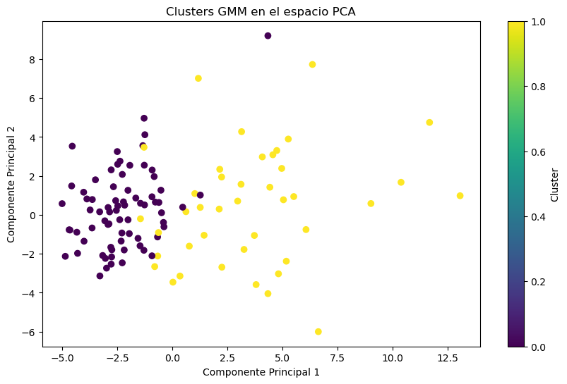
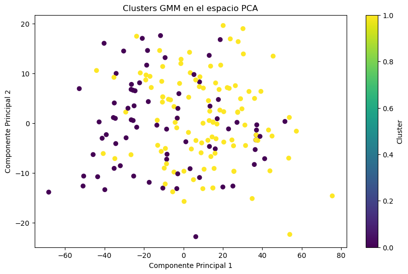

[](https://classroom.github.com/online_ide?assignment_repo_id=14959745&assignment_repo_type=AssignmentRepo)

# Código base para la tarea 5

En la tarea 5 se utilizan cuadernos de Jupyter para explorar varios
algoritmos de reducción de dimensiones, de aglomeración, y de
clasificación generativa.

Se utilizan dos casos de evaluación de medicina.

## Integrantes

- Carlos Andrés Mata Calderón
- David Badilla Marin

## Dependencias

### Para micromamba, conda, o mamba

Se tiene que crear un entorno llamado `t5`.

```bash
micromamba create -n t5 -y
```

```bash
micromamba install -c conda-forge \
matplotlib numpy \
scikit-learn jupyter pillow \
joblib scikit-learn-intelex \
pandas \
umap-learn \
-y
```

## Utilización del código

### Datos de cancer.ipynb

- Abrir la terminal en el directorio del proyecto.
- Ejecutar `micromamba activate t5`.
- Ejecutar `jupyter-notebook ./cancer.ipynb`
- Seleccionar Run>Run All Cells

### Datos de heart.ipynb

- Abrir la terminal en el directorio del proyecto.
- Ejecutar `micromamba activate t5`.
- Ejecutar `jupyter-notebook ./heart.ipynb`
- Seleccionar Run>Run All Cells

### PDF con las gráficas

Se creo un documento pdf del README, ya que el readme también tiene el resultados y Análisis. Este pdf se encuentra en la carpeta `docs/solution.pdf`. O bien, puede presionar este enlace con enlace [solution.pdf](docs/solution.pdf)

## Resultados y Análisis

### Resultados de cancer.ipynb


**¿Es posible identificar si hay ejes en el espacio original más importantes
que otros?**

Si claro note que la componente 1 es la que tiene tiene mayor varianza. Y si obtenemos los valores de las componentes sus eigenvector, notaremos que hay unos valores más altos que otros. Recuerde que cada componente del eigenvector corresponde a un tipo de "peso" de esa característica en el espacio original. Por lo quiere decir que si tiene mayor "peso" esa componente del eigenvector quiere decir esa característica aporta mucho en la varianza de los datos. Lo cuál quiere decir que es una característica importante para lograr identificar la clase.

**¿Es posible visualizar conglomerados en el subespacio bidimensional encontrado
con PCA?**

Si note que en el gráfico anterior como se encuentra una conglomerado en la parte izquierda superior de cáncer benigno, y un conglomerado en la parte derecha superior de cáncer maligno.


**De los experimentos anteriores, analice si se pueden observar conglomerados aparentes, y qué número de ellos podría ser interesante evaluar.**

Como consistentemente vemos dos conglomerados principales en los gráficos, decidimos usar k=2 para el algoritmo K-means.


La separación de clases mejora significativamente en comparación con el UMAP no supervisado sin K-means.


La supervisión adicional en UMAP podría estar introduciendo una complejidad que K-means no maneja bien, resultando en clústers menos definidos.




En el caso de GMM, los resultados de UMAP no supervisado y supervisado se comportan de forma similar, pero el GMM muestra clústeres más definidos.

### Resultados de heart.ipynb


**¿Es posible identificar si hay ejes en el espacio original más importantes
que otros?**

Para determinar si hay ejes en el espacio original que son más importantes que otros, se analizaron los componentes principales obtenidos a partir de la descomposición en valores propios (eigenvectores y eigenvalores).

Los primeros dos componentes principales, que representan la mayor varianza en los datos, son obtenidos a continuación:

Componente Principal 1:

    Age: 0.15787119155224105
    FastingBS: 0.013867971211921052
    MaxHR: -0.009173416273086168

Age tiene el mayor coeficiente en este componente (0.15787119155224105), indicando que la edad es la característica más importante para PC1.
FastingBS y MaxHR tienen coeficientes mucho menores, sugiriendo que su contribución a PC1 es mínima en comparación con Age.

Componente Principal 2:

    Age: 0.9864661388933637
    RestingECG: 0.026189011455039747
    Oldpeak: -0.013603500407191502

Age también tiene el coeficiente más alto en PC2 (0.9864661388933637), lo que sugiere que la edad es extremadamente importante para este componente.
RestingECG y Oldpeak tienen coeficientes significativamente menores, indicando que su contribución a PC2 es mínima.

**¿Es posible visualizar conglomerados en el subespacio bidimensional encontrado
con PCA?**

Es posible visualizar levemente la formación de dos conglomerados en la grafica anterior indicando que pueden haber subestructuras en los datos que corresponden a diferentes clases o categorías.

**Resultados con UMAP no supervisado con 130 números de vecinos y una distancia minima de 1**


**Resultados con UMAP supervisado con 130 números de vecinos y una distancia minima de 1**


**De los experimentos anteriores, analice si se pueden observar conglomerados aparentes, y qué número de ellos podría ser interesante evaluar.**

La visualización de UMAP supervisado muestra que los puntos están distribuidos en un espacio bidimensional, con una separación aparente entre algunas áreas, clasificando en dos clases completamente distintas como se esperaría al ser supervisado.

Como consistentemente vemos dos conglomerados principales en los gráficos, decidimos usar k=2 para el algoritmo K-means.

**Resultados con kmeans con PCA**


La separación de clases mejora significativamente en comparación con el UMAP no supervisado sin K-means obteniendo una separación de las clases más clara


La supervisión adicional en UMAP ayuda a incorporar la información de las etiquetas de clase durante la reducción de dimensionalidad, lo que debería teórica ayudar a separar mejor las clases. Sin embargo, la complejidad adicional introducida por esta supervisión puede hacer que los clusters resultantes sean más difíciles de manejar para un algoritmo de clustering no supervisado como K-means como se puede observar en la grafica anterior la ubicación de los clusters de K-means mal ubicados al hacer UMAP supervisado.

**Resultados con GMM y Diferentes Técnicas de Reducción de Dimensionalidad**

A continuación se muestran los resultados de aplicar un modelo de mezcla gaussiana (GMM) en los datos proyectados mediante PCA y UMAP (tanto no supervisado como supervisado):



Los clusters formados por GMM en el espacio PCA son levemente definidos. La separación entre clusters no es perfecta, lo que sugiere que PCA capta la estructura principal de los datos, pero no es completamente efectiva para separar todas las clases.


En la proyección UMAP no supervisada, los clusters formados por GMM también muestran cierto solapamiento, pero parecen estar más concentrados en comparación con PCA. La técnica de UMAP no supervisado no utiliza información de clase, lo que puede resultar en una menor separación entre clusters de diferentes clases.


La proyección UMAP supervisada muestra resultados similares al UMAP no supervisado en términos de la separación de clusters, pero con mucho menos puntos traslapados.
Sin embargo, los clusters formados por GMM en esta proyección parecen ser más definidos, lo que indica que la supervisión adicional ayuda a capturar mejor la estructura de clase en los datos.
